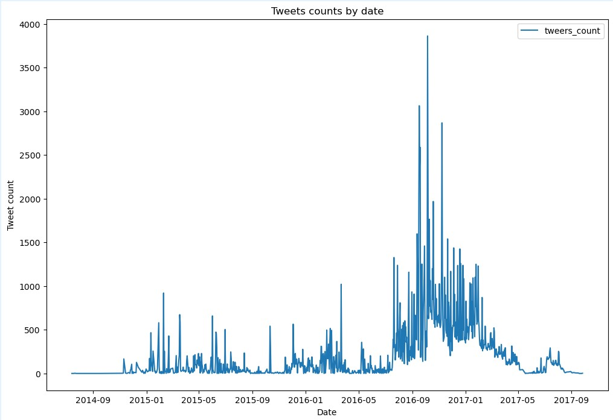
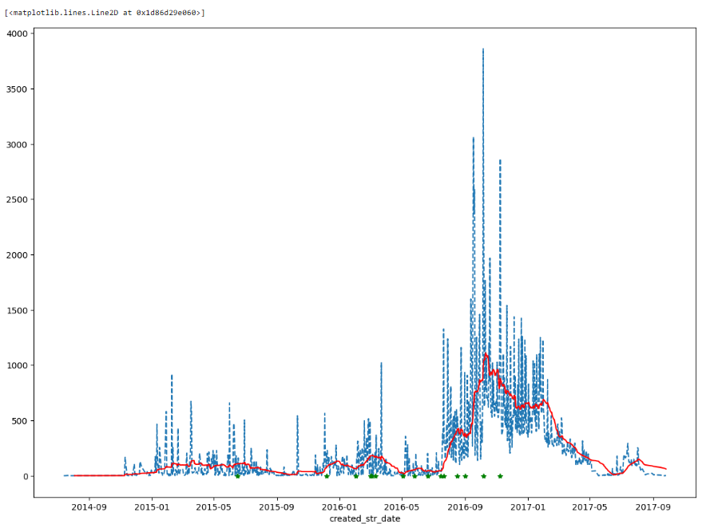

# Russian Tweets Analysis

## Project Overview
This project involves analyzing and processing a dataset of Russian tweets to extract valuable insights and patterns.

## Dataset
The dataset used for this analysis consists of Russian tweets collected from [source/link].

## Project Steps
1. **Data Cleaning**:
   - Identified and handled missing values.
   - Removed duplicates and irrelevant content.

2. **Text Processing**:
   - Tokenized tweets and removed stopwords.
   - Applied stemming and lemmatization.

3. **Sentiment Analysis**:
   - Performed sentiment analysis to classify tweets as positive, negative, or neutral.
   - Visualized sentiment distribution.
   - 
   - 

4. **Topic Modeling**:
   - Implemented topic modeling to identify common themes in the tweets.

5. **Data Visualization**:
   - Created visualizations to explore tweet distribution, sentiment trends, and topic frequency.

## Technologies Used
- **Python**: pandas, numpy, nltk, scikit-learn
- **Visualization**: Matplotlib, seaborn

## How to Run
1. Clone this repository:
   ```sh
   git clone https://github.com/your-username/russian-tweets-analysis.git
   cd russian-tweets-analysis
